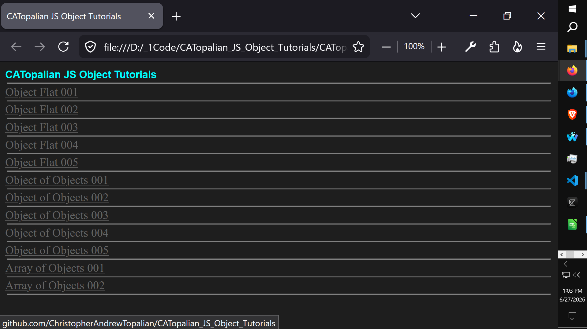

# CATopalian JS Object Tutorials
These JS tutorials teach flat objects, object of objects, array of objects, and much more.

---

How to Download this App
1. Click the green Code Button on this github page
2. Choose Download ZIP
3. Save the Zip File
4. Extract All
5. Double click the html file to start the app

---

//----//

// Dedicated to God the Father  
// All Rights Reserved Christopher Andrew Topalian Copyright 2000-2026  
// https://github.com/ChristopherTopalian  
// https://github.com/ChristopherAndrewTopalian  
// https://sites.google.com/view/CollegeOfScripting

